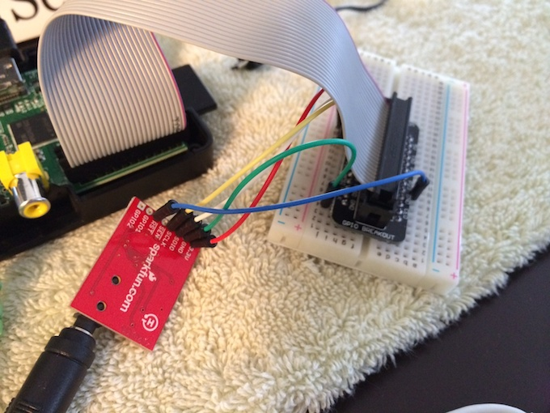

My Raspberry Pi Radio Project
=============================

Introduction
------------

This project contains the server-side code for a Raspberry Pi "Radio" system I have created. The system
lets you do the following things:

* Play local FM radio stations
* Play online radio streams
* Record online radio streams so you can listen to them later
* Play podcasts and other recorded files

You interact with the system using a web interface, which is shown in pictures in this document.
The web interface can be accessed on the Raspberry Pi (RPI) monitor (if it has one), a tablet, a phone,
a PC, or anything else that has a browser. In short, you can control this "radio" from any device
that has a browser.

The Future
----------

The system can be expanded in several ways that I can think of today:

* Let you play/control Pandora from the web UI
* Let you play music, such as your iTunes library
* Since the RPI is a Linux system, you can also play videos, and in general, do
  anything else that a Linux system can do
* If you use the system with an attached monitor, you can do some interesting things
  with screensavers. It seems weird to write about a "radio" having a screensaver, but
  once you have a computer monitor in your kitchen you start to think about what you'd like
  to see on that monitor. For me, I want to see the time, stock prices, Twitter tweets from
  people I like, news headlines, and all sorts of other things.

Background
----------

I _hate_ commercials on the radio, in part because there are so many of them. The thing that makes me scream "Khan!" is when I walk in the kitchen, turn on the radio, start to listen to a talk show, and within 30 seconds they go to a commercial. (Actually, the words I scream I can't print here, so I'll just say, "Khan!") It gets worse when I flip to the other station I like, and they're also on a commercial break.

I finally decided to solve this problem. I could have bought an online streaming radio, and I could have done other things as well, but I decided to build a Raspberry Pi (RPI) radio for these reasons:

* I want to listen to local radio stations.
* They aren't all available as radio streams.
* I didn't want to pay for a streaming radio. (Although "Grace Digital" radio systems are nice. Check them out.)
* I want to keep learning more about Arduino and RPI devices.


Form factor
-----------

The _form factor_ is important. I need to be able to walk into the kitchen and turn on my radio device easily. "Walking into the kitchen, forgetting my iPad, finding my iPad, walking back into the kitchen, turning on the iPad, finding a radio app, etc.", does not work for me. I just want to be able to walk into the kitchen and turn on the device like a normal, old-school radio.

Therefore, a perfect system for me would be a touchscreen device, but I haven't shelled out the money for a touchscreen monitor yet. The one thing I do have is an old 7" Android tablet. I also have a spare monitor (and an old mouse). I'm currently in the process of using the two of those devices as my primary UI to see which one I like best, but again, nothing will beat a touchscreen monitor attached to the RPI.


The Solution
------------

My current solution is a combination of hardware and software. The hardware is:

* An RPI motherboard
* An Si4703 FM radio chip
* (Sadly) Two sets of speakers (one for the RPI audio, one for the Si4703 audio; see below)
* A monitor, keyboard, and mouse (though I don't use the keyboard, except for development)
* An optional USB wireless network adapter

The software consists of:

* A Python script to control the Si4703 FM radio chip
* A Play Framework (Scala/Java) application to control almost everything else
* A shell script to make it easier to control the volume
* Startup scripts that go in _/etc/init.d_
* Use of Linux utilities, like VLC, Streamripper, and ALSA

The hardware is shown in the following images. This first image shows the RPI and the Si4703 chip:


This image shows a close-up of the Si4703:



This is what the web interface looks like on the RPI (Linux) monitor:


This is what the UI looks like on the Android tablet:


As you might be able to see from that photo, the web UI is definitely not ideal for the Android tablet. As a result, I'm thinking
about writing a separate "mobile" client for it.

This is a screenshot of the UI on my iPad:


Here's a better shot of the UI:

")

The web interface is kept in a separate project known as [AlRadioClient](https://github.com/alvinj/AlRadioClient).


Assumptions
-----------

For the rest of the document I'll make several assumptions:

* You're comfortable with the basics of an RPI, or that you have at least taken computers apart before (that's all I knew last week when I started).
* You are comfortable as a Linux administrator. You need to know how to make scripts executable, how to install software with `apt-get`, how to create directories, copy files, create crontab entries, use `ssh` and `scp`, and more.
* You can configure the Nginx web server (using my _nginx.conf_ file below), or can use the Apache web server instead of Nginx. (The big thing is that you'll need to set up a reverse-proxy server.)
* If you want to change any of the code you'll need to know Scala, the Play Framework, Python, and Unix shell programming. (I intentionally don't use a database at this time. Radio stations and streams are set in the Play _rpi.conf_ file. I would like to change that, but I'm out of time right now.)


Building the Radio (The Hardware)
---------------------------------

If you haven't used an RPI before, or soldered anything before, the hardware might seem a little daunting. But (a) if you know Linux, the RPI isn't too hard to learn, and (b) you only need to learn how to solder things if you want to use the Si4703 FM radio chip.

The manadatory hardware requirements are:

* An RPI board
* A monitor, mouse, and keyboard
* Either (a) a set of speakers, or (b) an HDMI monitor with built-in speakers

You may also want to use a USB wireless network adapter. If not, just plug a network cable into the NIC on the RPI motherboard.

If you want to use the Si4703 FM radio chip, the other requirements are:

* An Si4703 FM radio chip
* A breakout board
* Wires to connect the RPI to the Si4703
* Soldering equipment
* A set of speakers to handle the audio output from the Si4703

If you use the Si4703 you'll need to solder it, so you'll need soldering equipment, and a little know-how. I never soldered anything in my life until last week, so I can tell you it's not too hard.

In theory I should be able to pipe the audio out of the Si4703 and into the RPI mic, then out the RPI speakers, but so far the sound quality has been poor.


How the Software Works
----------------------

Here are some notes on how the software works:

* A Python script in _/var/www/radio/scripts_ controls the Si4703 chip.
* A Play Framework server in _/var/www/radio/server_ provides a REST interface.
* The "desktop" UI is written in Sencha ExtJS, which is a JavaScript UI framework.
* I may also write a "mobile" UI to work better with my Android tablet. If so, I'll write that using Sencha Touch, which is Sencha's mobile UI framework.
* The JavaScript UI is served by the Nginx web server. Nginx is configured as a reverse-provides server so the Sencha ExtJS UI thinks Play is running on the same port as the UI (port 80).
* Streaming audio, podcasts, and other files -- such as MP3 music files -- are played with the VLC utility. (I also looked at using `mpd` and `mpc`, but decided to run everything with VLC.) VLC commands are issued by the Play server application.
* Streaming audio files are recorded with `Streamripper`. The timing of those streams being ripped is controlled by Linux `crontab` entries.
* The RPI audio volume is controlled with an ALSA script I found. That script is named =volume=, and is in the _/var/www/radio/scripts_ directory.
* Nginx, the Play application, and the Python/Si4703 script are all started when the system boots. I created startup scripts for the Play app and Python script, copied them to _/etc/init.d_, and ran some other command I can't remember at the moment to make sure they're started at boot time.


Dependencies
------------

The radio system depends on plenty of other software:

* Java
* Python
* VLC
* Streamripper
* The Linux ALSA utilities


Directory Layout
----------------

I've moved everything under a _/var/www/radio_ directory structure. My current directory structure looks like this:

```
.
|--- client
│-- |--- app.js
│-- |--- index.html
│-- |--- resources
|--- data
│-- |--- music
│-- |--- pls-files
│-- │-- |--- 104_3.pls
│-- │-- |--- espn-1400.pls
│-- │-- |--- espn-wfbx.pls
│-- │-- |--- ktna-talkeetna.pls
│-- │-- |--- wbbm-am.pls
│-- │-- |--- wgn.pls
│-- │-- |--- whas-am.m3u
│-- |--- podcasts
│-- │-- |--- BG_Episode319_Mass_Meditation_Movement.mp3
│-- │-- |--- BG_Episode322_Eco_Dharma.mp3
│-- │-- |--- BG_Episode323_Bodhisattva_Activist.mp3
│-- |--- recordings
│--     |--- 104_3.2014_Sat_May_24_1200pm.aac
│--     |--- 104_3.2014_Sat_May_24_1200pm.cue
│--     |--- 104_3.2014_Sat_May_24_1300pm.aac
│--     |--- 104_3.2014_Sat_May_24_1300pm.cue
│--     |--- 104_3.2014_Sun_May_25_1200pm.aac
│--     |--- 104_3.2014_Sun_May_25_1200pm.cue
│--     |--- 104_3.2014_Sun_May_25_1300pm.aac
│--     |--- 104_3.2014_Sun_May_25_1300pm.cue
│--     |--- 104_3.sh
│--     |--- ESPN 1400
│--     │-- |--- incomplete
│--     │--     |---  - .mp3
│--     |--- espn.2014_05_22_22_27.cue
│--     |--- espn.2014_05_22_22_27.mp3
│--     |--- espn.2014_05_22.cue
│--     |--- espn.2014_05_22.mp3
│--     |--- espn.2014_05_23_06_00.cue
│--     |--- espn.2014_05_23_06_00.mp3
│--     |--- espn.2014_05_23_07_00.cue
│--     |--- espn.2014_05_23_07_00.mp3
│--     |--- espn.sh
│--     |--- README.txt
│--     |--- Streamripper_rips
│--         |--- incomplete
│--             |---  - .aac
|--- logs
│-- |--- 104_3.log
│-- |--- espn.log
│-- |--- play.log
|--- scripts
│-- |--- init.d-scripts
│-- │-- |--- fmradio.sh
│-- │-- |--- playserver.sh
│-- |--- python
│-- │-- |--- bottle1.py
│-- │-- |--- run.sh
│-- │-- |--- server.py
│-- │-- |--- si4703.py
│-- │-- |--- si4703.pyc
│-- |--- vol
|--- server
│-- |--- alradio-1.0-SNAPSHOT
│-- │-- |--- bin
│-- │-- │-- |--- alradio
│-- │-- │-- |--- alradio.bat
│-- │-- |--- conf
│-- │-- │-- |--- application.conf
│-- │-- │-- |--- rpi.conf
│-- │-- |--- lib
│-- │-- |--- logs
│-- │-- │-- |--- application.log
│-- │-- |--- README
│-- │-- |--- RUNNING_PID
│-- │-- |--- share
│-- │--     |--- doc
│-- |--- alradio-1.0-SNAPSHOT.zip
│-- |--- bg-run.sh
│-- |--- current -> alradio-1.0-SNAPSHOT
│-- |--- nohup.out
│-- |--- run.sh
│-- |--- scripts
│--     |--- getRadioStations.sh
│--     |--- getRadioStreams.sh
│--     |--- getRecordings.sh
│--     |--- radio-shutdown.sh
│--     |--- stream-pause.sh
│--     |--- stream-play.sh
│--     |--- stream-shutdown.sh
│--     |--- stream-start.sh

```

I excluded a few of the deeper directories from that list, but that gives you the general idea.

Also, I changed the naming structure of the recorded radio streams, so you'll see files there with different naming patterns.


The UI
------

As mentioned, the current UI is a desktop web application written using Sencha ExtJS. This is what it looks like:

")

The code for that project is kept in this Github repo: [AlRadioClient](https://github.com/alvinj/AlRadioClient).


Crontab Entries
---------------

My current crontab file -- as seen with the `crontab -e` command -- looks like this:

```
# espn (mike+mike at 6am and 7am)
0 6 * * * /var/www/radio/data/recordings/espn.sh  > /var/www/radio/logs/espn.log 2>&1
0 7 * * * /var/www/radio/data/recordings/espn.sh  > /var/www/radio/logs/espn.log 2>&1

# 104.3 (afternoon guys)
0 12 * * * /var/www/radio/data/recordings/104_3.sh  > /var/www/radio/logs/104_3.log 2>&1
0 13 * * * /var/www/radio/data/recordings/104_3.sh  > /var/www/radio/logs/104_3.log 2>&1
```

The Nginx Configuration
-----------------------

My _/etc/nginx/nginx.conf_ file looks like this:

```
user www-data;
worker_processes 4;
pid /var/run/nginx.pid;

events {
	worker_connections 768;
	# multi_accept on;
}

http {

	sendfile on;
	tcp_nopush on;
	tcp_nodelay on;
	keepalive_timeout 65;
	types_hash_max_size 2048;

	include /etc/nginx/mime.types;
	default_type application/octet-stream;

	##
	# Logging Settings
	##

	access_log /var/log/nginx/access.log;
	error_log /var/log/nginx/error.log;

	##
	# Gzip Settings
	##

	gzip on;
	gzip_disable "msie6";

    # ---------
    # RADIO APP
    # ---------

    # play server runs on port 9000
    upstream radio_server {
      server 127.0.0.1:9000;
    }

    server {

      # put `radio` in /etc/hosts
      #server_name  radio;
      listen        80;

      location / {
        index       index.html;
        root        /var/www/radio/client;
      }

      location /server {
        proxy_pass  http://radio_server;
      }

    }

}
```


Streaming Audio Files
---------------------

As mentioned earlier, streaming audio files are recorded with `Streamripper`. The timing of those streams being ripped is controlled by Linux `crontab` entries. Those files aren't currently deleted, but very soon I'll write a script to delete files that are older than ~2 days.


PLS Files for Online Radio Streams
----------------------------------

VLC can read PLS files, and that's how the online audio streams work. I download the PLS files for the stations I want to stream, put them in _/var/www/radio/data/pls-files_, and then add them to the Play _rpi.conf_ file.

I get the PLS files from these URLs:

* [radio-locator.com](http://radio-locator.com/)

Streams work with the `vlc` command, which is run from the Play Server code. The `vlc` command looks
like this:

    vlc /var/www/radio/data/pls-files/espn-1400.pls --rc-host localhost:5150 -I dummy -I rc

When the system is running and playing a stream, you can continuously display that process with this command:

    while true; do ps auxwwww | grep vlc; sleep 0.5; done


Podcasts
--------

I don't listen to podcasts very often, so right now I'm just downloading podcasts manually and copying them into the _/var/www/radio/data/podcasts_ directory. The Play application sees those files when it boots, and provides them through a REST API call, which is named something like _/radio/getPodcasts_.

The only podcasts I've downloaded so far are from an organization known as "Buddhist Geeks", and I got their podcasts from this URL:

* http://feeds.feedburner.com/BuddhistGeeksPodcast

Update: I got their MP3 files directly from this URL: http://www.buddhistgeeks.org/audio/


The Play Framework REST API
---------------------------

The Play REST API looks like this:

    # --------------
    # online streams
    # --------------

    GET /server/playStream                   controllers.Radio.playStream(streamName: String)
    GET /server/pauseVlc                     controllers.Radio.pauseVlc
    GET /server/playVlc                      controllers.Radio.playVlc
    GET /server/turnVlcOff                   controllers.Radio.shutdownVlc

    # --------
    # fm radio
    # --------

    GET /server/tuneRadio                    controllers.Radio.tuneRadio(station: String)
    GET /server/turnRadioOff                 controllers.Radio.turnRadioOff

    # ---------------------
    # information/utilities
    # ---------------------

    GET /server/getRadioStations             controllers.Radio.getRadioStations
    GET /server/getRadioStreams              controllers.Radio.getRadioStreams

    GET /server/turnEverythingOff            controllers.Radio.turnEverythingOff
    GET /server/setVolume                    controllers.Radio.setVolume(volume: Int)
    GET /server/seek                         controllers.Radio.seek(value: String)

    # recordings

    GET /server/getRecordings                controllers.Radio.getRecordings(_dc: String)
    GET /server/playRecording                controllers.Radio.playRecording(recordingFilename: String)

    # podcasts

    GET /server/getPodcasts                  controllers.Radio.getPodcasts(_dc: String)
    GET /server/playPodcast                  controllers.Radio.playPodcast(podcastFilename: String)

I'm lazy, so that's a straight copy/paste of the Play _routes_ file.


Screensaver
-----------

You can do whatever you want for a screensaver, but I'm currently using "daliclock", and I'm also planning to write my own custom screensaver. Since I have a full monitor, I want to show:

* The time
* Current stock prices
* The current weather and/or weather forecast

The ~/.xscreensaver file is very long, so I won't list it here. I'll include a copy of it in this Git repo.


Installation/Configuration Steps
--------------------------------

This section is hard to write, I have to do most of it from memory, but here goes:

* Get an RPI Model B.
* Connect the monitor, keyboard, mouse, and network cable.
* Install the wireless network adapter if you're going to use it.
* If you want FM radio reception, get a Si4703 chip, soldering equipment, breadboard, and wires. Solder the Si4703 as needed, and connect it to the RPI.
* If you're using the Si4703, install the Si4703 Python script.
* Install VLC and Streamripper.
* Install all of the software under _/var/www/radio_. All of those files should be owned by the _pi_ user.
* Install the startup scripts in _/etc/init.d_. Do the second step needed after that.
* If you're going to use the monitor after everything is set up, configure a screensaver.


Linux System Installation
-------------------------

As mentioned, the Radio Pi system requires plenty of other software.

This is a list of `apt-get` commands that are needed:

    sudo apt-get upgrade
    sudo apt-get install nginx
    sudo apt-get install xscreensaver
    sudo apt-get install xscreensaver-data-extra
    sudo apt-get install vlc
    sudo apt-get install streamripper
    
    # need this to get python 'feedparser' (for news feeds (ie, with a monitor))
    sudo apt-get install python3-pip
    
    # not needed, already installed
    sudo apt-get install alsa-utils

### The Play Server Configuration

* TODO: need to get the Play server to start automatically. I have the /etc/init.d/playserver.sh startup
  script already created, but you need to set the permissions on it once you put it in the /etc/init.d
  directory:

    http://www.stuffaboutcode.com/2012/06/raspberry-pi-run-program-at-start-up.html
    http://raspberrypi.stackexchange.com/questions/8734/execute-script-on-start-up (dup of previous link)

### Nginx

As noted above, the Nginx configuration file needs to be copied to the right location

### Screensaver Configuration

* copy the screensaver configuration file to the right location (~/.xscreensaver)
* useful commands:

    http://alvinalexander.com/source-code/linux-unix/some-linux-xscreensaver-commands
    http://alvinalexander.com/linux-unix/xdaliclock-xscreensaver-install-rpi-debian-linux

* you need to run those commands from the RPI GUI itself, not from an ssh session

### Newsfeed Configuration

* You need the Python 'feedparser' library:

    # from http://www.pythonforbeginners.com/feedparser/using-feedparser-in-python:
    # install 'feedparser' with `pip`, after installing pip with apt-get

* Pip install info: https://www.raspberrypi.org/documentation/linux/software/python.md

    # use these commands to install pip and then feedparser
    sudo apt-get install python-pip     # install `pip` for python 2
    sudo pip install feedparser         # use pip to install the feedparser module


